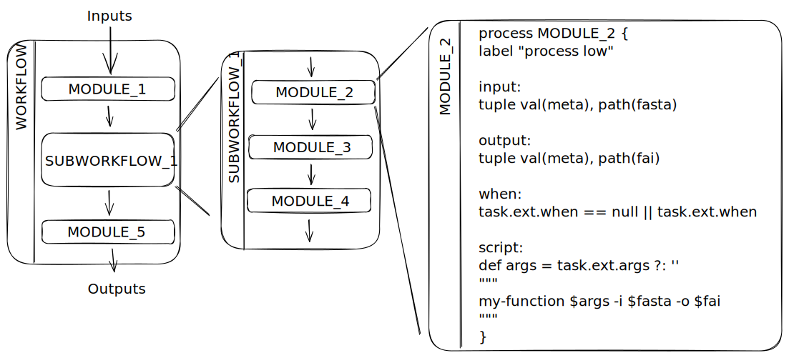

# Overview



The relationship between these components can be summarized as follows:

* A workflow is composed of one or more named workflows / processes, which are connected together using channels.
* Channels facilitate the transfer of data between processes, and operators can be used to manipulate the data flowing through channels.
* Modules provide a way to encapsulate and reuse sets of related processes, promoting code organization and modularity.

| Component | Usage | Structure | Relationship |
|-----------|-------|-----------|--------------|
| Workflow | Defines the sequence of operations and dependencies between processes. | Defined using the `workflow` keyword. Can include multiple processes and channels. Named workflow is called a subworkflow and can be included in workflow as well. | Top-level construct that orchestrates the execution of processes and data flow. |
| Process | Represents a computational task or operation within the workflow. | Defined using the `process` keyword, followed by a name and code block enclosed in `{}`. | Building blocks of workflows. Connected through channels to pass data. |
| Channel | Facilitates the transfer of data between processes. | Created using `Channel.from()` or `Channel.of()`. Can carry various data types. | Enables communication and data flow between processes. |
| Operator | Manipulates channels by filtering, transforming, or combining data streams. | Applied to channels using the `.` operator followed by the operator name and parameters. | Acts on channels to modify the data stream within workflows. |
| Module | Encapsulates a set of related processes and channels for reusability. | Defined in a separate Nextflow file and included using the `include` directive. | Promotes code organization and reuse of workflow components. |


# Channels

**Note:** *Nextflow website* **https://training.nextflow.io/fundamentals/channels/**

Channels are a crucial Nextflow feature that supports reactive and functional workflow design based on the Dataflow programming concept. They link tasks logically and enable data transformations in a functional style.

## Channel Types

- Queue channel
- Value channels
  - Created using the `value()` factory function
  - Optionally bind the channel to a specific value with a non-null argument

## Channel Factories

The following Channel factories are available:

- `of()`: Creates a channel with implicit inputs
- `fromList()`: Create from a list of items
- `fromPath()`: Create from file paths
- `fromFilePairs()`: Create pairs of files from a directory
- `fromSRA()`: Fetch sequencing reads from Sequence Read Archive (SRA)

**Tip:** `channel` is an alias for Channel.

Channels can be converted to other types using operators:

- `.first()` returns the first item of a value channel.

Factory methods and operators can be chained, e.g. `Channel.fromFilePairs().first()`.

# Processes

## Full Syntax
```groovy
// [ ... ] represents a list
process < name > {
    [ directives ] 

    input: 
    < process inputs >

    output: 
    < process outputs >

    when: 
    < condition >

    [script|shell|exec]: 
    """
    < user script to be executed >
    """
}
```

## Directives
[List of directives](https://www.nextflow.io/docs/stable/process.html#directives)

# Operators
[List of operators](https://www.nextflow.io/docs/stable/operator.html)

# Nextflow Configuration
The sources are ranked to decide which settings to apply. List in order of priority in the case of conflicting settings:

1. Parameters specified on the command line (--parameter)
2. Parameters that are provided using the -params-file option
3. Config file that are provided using the -c option
4. The config file named nextflow.config in the current directory
5. The config file named nextflow.config in the pipeline project directory
6. The config file $HOME/.nextflow/config
7. Values defined within the pipeline script itself (e.g., main.nf)

# Training
1. [Pipeline_Training_with_Nextflow](https://carpentries-incubator.github.io/Pipeline_Training_with_Nextflow/)
2. [training.nextflow.io](https://training.nextflow.io/basic_training/)

# Best Practices
- https://carpentries-incubator.github.io/Pipeline_Training_with_Nextflow/07-Nextflow_Best_Practice/index.html
- https://bioinfo-guidelines.readthedocs.io/en/latest/nextflow/running.html#nextflow-best-practices
- Use `nf-core create` for project boilerplate
